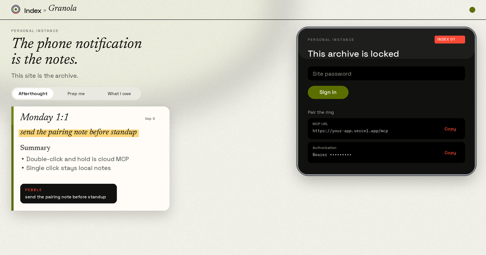

# Index × Granola

The phone notification is the notes. This site is the archive.

Double-click and hold Index 01. Afterthought, prep, or what you owe, from Granola, as a Pebble notification. Sign in on the site. Paste one MCP URL into the Pebble app. Granola stays read-only.

One Granola login, one ring, one password. Deploy your own. Not a multi-user host. Not affiliated with Pebble or Granola.

[](https://vercel.com/new/clone?repository-url=https://github.com/Shimku/PebbleGranola&env=SITE_PASSWORD,DATABASE_URL&envDescription=SITE_PASSWORD%20locks%20the%20archive%20(8%2B%20chars).%20DATABASE_URL%20is%20a%20Neon%20Postgres%20url.&project-name=index-granola&repository-name=index-granola)

Free Granola is enough. Matching only looks at the last 30 days.

## Pair the ring

You need an Index 01 in the Pebble app, and a Granola account with some notes in the last 30 days.

1. Deploy, sign in, tap **Connect Granola**.
2. Pebble app → Index → **MCP & Tool Settings** → new sandbox. Model: **Default** or **High Capability** (cloud). The offline Index agent cannot use custom MCP.
3. Add MCP. Streamable HTTP on. URL and Bearer from **Pair**.
4. Enable the `ring_voice` prompt.
5. **Double click and hold** → this sandbox.
6. Leave single click as local notes.

There is no Run button on the website. Speak from the ring.

Pebble custom MCP only sends a static `Authorization` header. Granola MCP only speaks browser OAuth.

Do **not** put Vercel Deployment Protection or SSO on the production domain. The ring cannot send `x-vercel-protection-bypass`.

## Deploy

1. Click **Deploy with Vercel** above (or fork this repo and import it).
2. Create a [Neon](https://neon.tech) Postgres database. Paste its URL into `DATABASE_URL`.
3. Set `SITE_PASSWORD` (8+ characters). This locks the website. `/mcp` stays open for the ring.
4. Deploy. Open the site, sign in, tap **Connect Granola**.
5. Copy the MCP URL and Bearer from **Pair**. Paste them into Pebble.

## Local

```bash
cp .env.example .env.local
# DATABASE_URL = Neon Postgres
# SITE_PASSWORD = 8+ characters
npm install
npm run dev
```

Open [http://localhost:3000](http://localhost:3000), sign in, tap **Connect Granola**.

If you used [neon.new](https://neon.new), open the claim URL on the site within 72 hours or the data disappears.

| Name | Required | Notes |
| --- | --- | --- |
| `DATABASE_URL` | yes | Neon Postgres connection string |
| `SITE_PASSWORD` | yes | Locks the website. `/mcp` stays open for the ring Bearer. |
| `NEON_CLAIM_URL` | no | Shown in the UI so you can keep a neon.new database |
| `PEBBLE_MCP_TOKEN` | no | Generated on first boot if unset. If set, it wins over the DB token. |
| `APP_URL` | no | Defaults to the current host. Set this if OAuth redirects to the wrong place |

## Matching

Meetings from the last 30 days. Title and attendees scored against the words you spoke. `VERV<>ASA` matches “Verve”. Close spellings still hit. A named miss does not invent a meeting.

Prep and What I owe can pull a few recent matches. Afterthoughts stick to the latest. The Index notification is a few bullets. The same record lands in the archive under a company thread.

## Security

Each deploy is one locker. Set `SITE_PASSWORD` before you share the URL. Visitors see the lock screen. The archive, Granola email, and Bearer are not in that HTML.

`POST /mcp` stays open for the ring. Anyone with the Bearer can query your notes that way. Rotate it under **Pair** if it leaked, then paste the new value in Pebble.

Old unique `*.vercel.app` deploy URLs keep the code from that deploy. If that build is older than the lock, it can still read the live database. In Vercel: Authentication on **Production deployment URLs and all previews**, not the production domain.

## License

MIT. See [LICENSE](LICENSE).
