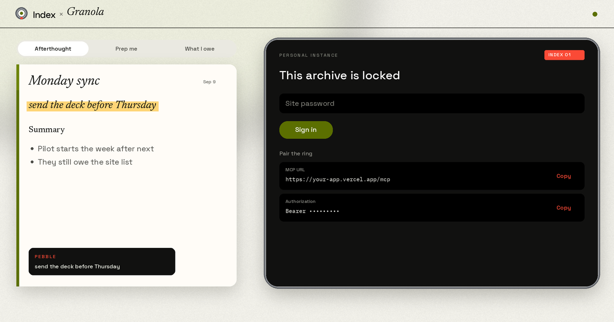

# Index × Granola

Ask your Granola notes from a Pebble Index 01.

The ring can call an MCP server with a Bearer token. Granola's MCP only logs in through the browser. This app keeps that login and gives the ring a `/mcp` URL.

Double-click and hold:

- **Afterthought**: something you forgot, kept with that meeting
- **Prep me**: a short brief before a call
- **What I owe**: open loops from the notes

Pebble shows the reply on your phone. Older replies stay on the site. Nothing is written back to Granola.

Deploy your own copy. Set a password, connect Granola, and paste the MCP URL from **Pair** into the Pebble app. Not affiliated with Pebble or Granola.

A free Granola account works. Only the last 30 days of notes are searched.

[](https://vercel.com/new/clone?repository-url=https://github.com/Shimku/PebbleGranola&env=SITE_PASSWORD,DATABASE_URL&envDescription=SITE_PASSWORD%20locks%20the%20archive%20(8%2B%20chars).%20DATABASE_URL%20is%20a%20Neon%20Postgres%20url.&project-name=index-granola&repository-name=index-granola)

## Pair the ring

1. Sign in, tap **Connect Granola**.
2. Pebble app → Index → **MCP & Tool Settings** → new sandbox. Model: **Default** or **High Capability** (cloud). The offline Index agent cannot use custom MCP.
3. Add MCP. Streamable HTTP on. Copy the URL and Bearer from **Pair**.
4. Enable `ring_voice`.
5. **Double click and hold** → this sandbox. Leave single click as local notes.

There is no Run button. You talk to the ring.

Do not turn on Vercel Deployment Protection on the production domain. The ring cannot log into Vercel, so `/mcp` would stop working.

## Deploy

1. Click **Deploy with Vercel**, or fork the repo and import it.
2. Create a [Neon](https://neon.tech) database and set `DATABASE_URL`.
3. Set `SITE_PASSWORD` (8+ characters). That locks the website. `/mcp` stays open for the ring.
4. Open the site, connect Granola, and copy **Pair** into Pebble.

## Local

```bash
cp .env.example .env.local
# DATABASE_URL = Neon Postgres
# SITE_PASSWORD = 8+ characters
npm install
npm run dev
```

Open [http://localhost:3000](http://localhost:3000), sign in, and connect Granola.

| Name | Required | Notes |
| --- | --- | --- |
| `DATABASE_URL` | yes | Neon Postgres |
| `SITE_PASSWORD` | yes | Locks the website |
| `NEON_CLAIM_URL` | no | If you used neon.new |
| `PEBBLE_MCP_TOKEN` | no | Generated on first boot if unset |
| `APP_URL` | no | Set this if the Granola redirect goes to the wrong host |

## License

MIT. See [LICENSE](LICENSE).
